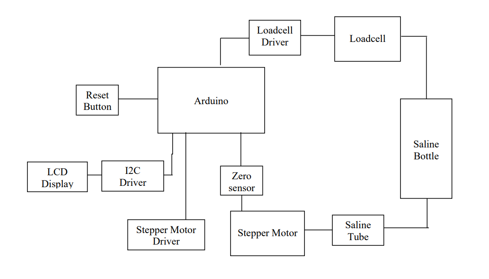
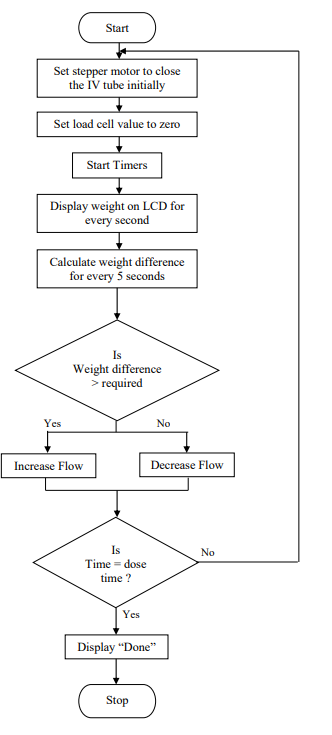
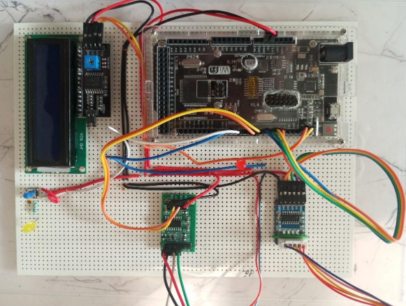
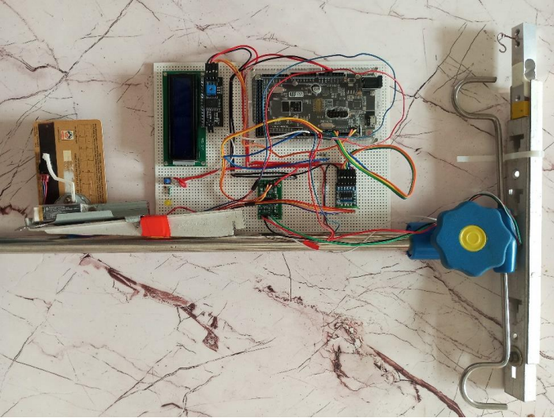
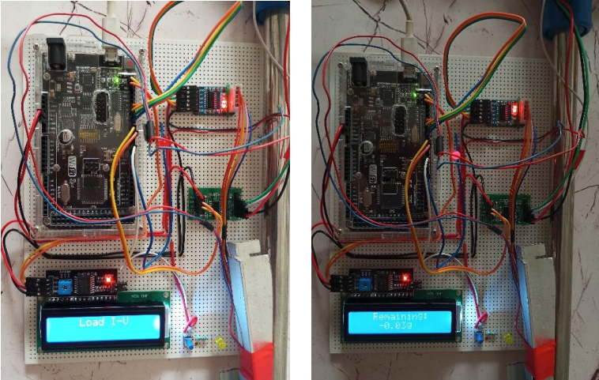

# IV Monitoring and Control System

> A project aimed at enhancing the **accuracy**, **efficiency**, and **safety** of conventional intravenous (IV) therapy systems using automated monitoring and control mechanisms.

## 📌 Introduction

Manual IV systems, though widely used, are prone to human error — especially during long shifts in hospitals. Inaccurate flow rates, air bubbles in the tubing, and tissue damage due to uncontrolled flow are common yet serious issues that can lead to medical mishaps or even casualties.

This project was developed with the motivation to **address and solve** these issues by building a smart IV monitoring and control system using electronics and automation principles. With guidance from **Dr. Anil Magdum**, who provided deep insight into real medical scenarios, the team successfully identified, designed, and implemented a solution meeting several medical safety standards.

---

## 🎯 Objectives

- ✅ Design a fully **automated IV monitoring and control** system.
- 🎯 Achieve **accuracy within 2%**, which is medically acceptable for IV infusion.
- ⚙️ Use hardware and components **aligned with medical standards**.
- 🧩 Ensure **compact size**, **low cost**, and **reliable performance**.
- 🏥 Make the system **easily mountable** on standard IV stands without disrupting their normal operation.

---

## 🔍 Problems Identified

Through field research and expert consultation, especially with Dr. Magdum, the following problems were identified in current manual IV setups:

- ⚠️ **Improper flow rate** due to gravity changes as saline weight reduces.
- ⏱️ **Lack of timely follow-ups**, leading to over/under infusion.
- 💨 **Air bubbles** formation in the IV line, potentially harmful if they enter the bloodstream.
- 🧫 **Infusion into tissues** due to excessive flow, causing inflammation or tissue damage.

---

## 💡 Proposed Solution

Our system continuously monitors the IV flow using sensors and controls it using actuators (like stepper motors). The following features are implemented:

- Real-time flow rate monitoring
- Automated control of flow using a motor mechanism
- Alerts in case of abnormal conditions (e.g., air bubbles or no flow)
- Simple user interface for medical staff
- Compact and adaptable hardware for IV stand mounting

---

## 👨‍💻 Technologies Used

- 💻 **Microcontroller:** Arduino (or equivalent)
- ⚙️ **Sensors:** Load cell, flow sensor, bubble detection sensor
- 🔧 **Actuators:** Stepper motor for flow control
- 🖥️ **Interface:** Local web dashboard or serial output
- ⚡ **Power Supply:** Battery/adapter-based

---

## 🧪 Accuracy & Compliance

- The system was tested to operate within a **±2% error margin**.
- Efforts were made to keep the system **medically safe, non-invasive, and reliable**.

---

## 🙏 Acknowledgements

Special thanks to:

- **Dr. Anil Magdum** – for his medical expertise and support.
- All team members and contributors who collaborated and made this project successful.

---

## 📅 Academic Information

- 🎓 Academic Year: **2023-24**
- 🧑‍🎓 Branch: **Industrial Electronics (TYIE)**
- 📘 Subject: **Project Work**

---

## 📎 License

This project is for academic and educational use only. For commercial/clinical deployment, regulatory approvals must be obtained.

---

## 📷 Screenshots & Diagrams

---

## 📬 Contact

For more information, suggestions, or collaborations, feel free to open an issue or reach out.

